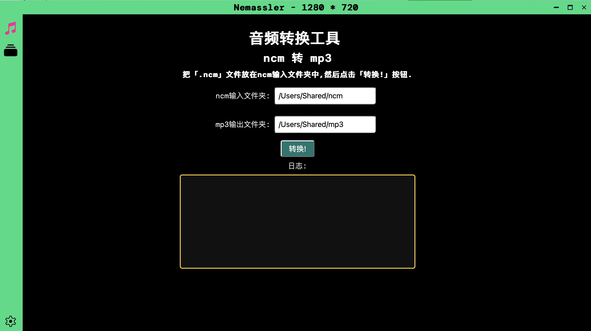
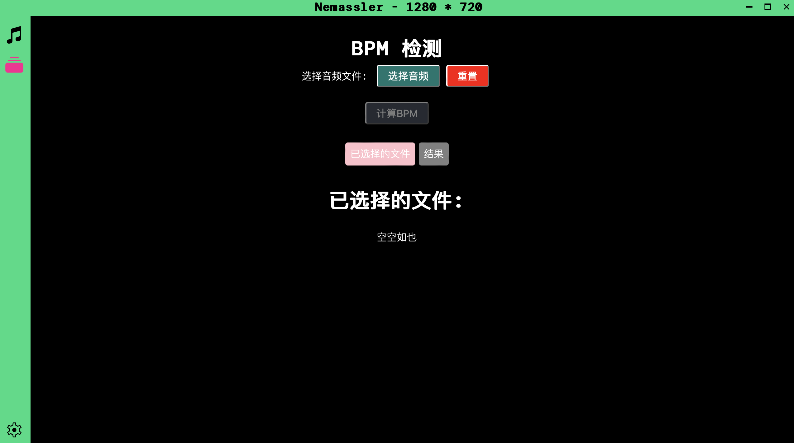
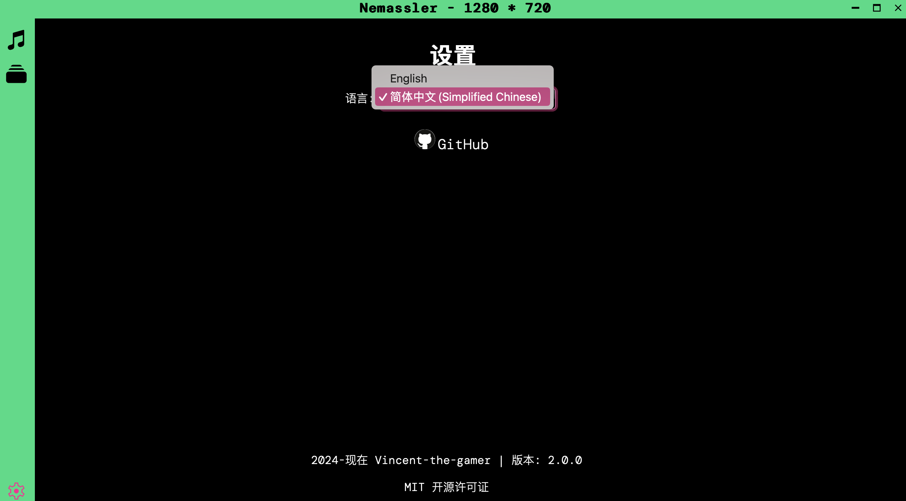

<p align="center">
  
</p>

<h1 align="center">Nemassler</h1>

<p align="center">
  Transform netease <b>.ncm</b> audios into <b>mp3</b> and calculate audio BPM, built in Rust.
</p>

> [!NOTE]
> This is v2.x version of nemassler, find v1 [here](https://github.com/Vincent-the-gamer/nemassler/tree/v1).

# Dev
## Bump versions of `Cargo.toml`

1. Install `cargo-edit` globally

```shell
cargo install cargo-edit --features vendored-openssl
```

2. Run `cargo upgrade`.

```shell
cargo upgrade
```

P.S. Check your global cargo packs with `cargo install --list`


# Build

## GitHub Actions
Edit `.github/workflows/release.yml`,

```yaml
steps:
  - uses: actions/checkout@v2

  # 创建 release
  - name: Create Release
    id: create_release
    uses: actions/create-release@v1
    env:
      GITHUB_TOKEN: ${{ secrets.GITHUB_TOKEN }}
    with:
      tag_name: 'v2.0.0' # Change here to your release version.
      release_name: 'Nemassler v2.0.0' # Release title.
      body: 'Released by GitHub Actions.' # Release content.
```

CI will trigger on `release` branch push.


## Manual Build
```shell
pnpm tauri build
```

# Preview



