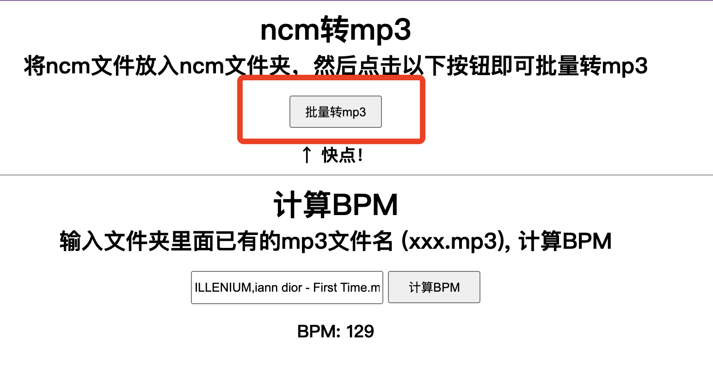

# 音频处理工具

English Version: [README.md](./README.md)

本工具是流水线式处理音频，直接将wyy音乐的ncm格式一键转换为mp3，然后计算音频的bpm

## 使用
该项目依赖`Node.js`,请先安装

Node.js中文网: [http://nodejs.p2hp.com/](http://nodejs.p2hp.com/)

### 拉取项目
~~~shell
git clone https://github.com/Vincent-the-gamer/audio-tools.git
~~~

### 安装依赖
~~~shell
yarn install
~~~

### 运行代码
~~~shell
yarn start
~~~

### 开始使用

#### ncm -> mp3
启动代码后，访问`http://localhost:8080`页面

把需要转换的ncm全部放入项目的`ncm`文件夹，然后点击页面:

然后mp3和曲封面会输出到`public/mp3`文件夹下，自取就好

#### 计算BPM
目前没有做优化，请手动输入`mp3文件夹里面的文件名`，之后会优化成下拉选择。

注意，必须将mp3放入`public/mp3`文件夹下，然后输入文件名进行bpm计算。