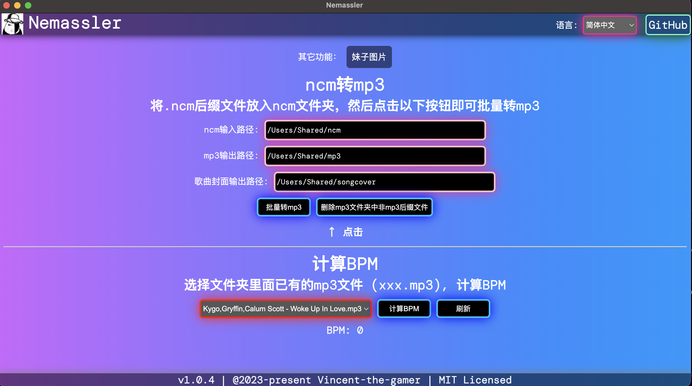

  

<h1 align="center">Nemassler</h1>

  一个很实用的多功能工具  
  主要将.ncm音频文件转.mp3，还有计算音频BPM

  抛瓦来自
   
  

  <a href="./README.md" target="_blank">English</a>
  |
  中文文档

## 安装
下载构建好的程序: 

**最新版本: v1.0.3**

[https://github.com/Vincent-the-gamer/Nemassler/releases](https://github.com/Vincent-the-gamer/Nemassler/releases)

macOS提示已损坏，你应该把它扔到废纸篓?
* 打开终端
* 输入 `xattr -d com.apple.quarantine `
* 把软件图标拖进终端，自动填入路径
* 按下回车
* 重新打开软件即可

## 页面总览

现在，你可以在右上角切换语言了，有`简体中文`和`英语`。

## 开始使用
### ncm 转 mp3

把需要转换的ncm全部放入`你的ncm输入路径`，然后点击页面:

然后mp3和曲封面会输出到`你的mp3输出路径`下，自取就好

### 默认文件夹路径
* Windows: 
    * ncm: C:\\Users\\public\\ncm
    * mp3: C:\\Users\\public\\mp3
    * songcover: C:\\Users\\public\\songcover
* macOS
    * ncm: /Users/Shared/ncm
    * mp3: /Users/Shared/mp3
    * songcover: /Users/Shared/songcover

### 计算BPM（每分钟的节拍数）
选择生成的mp3，或者自己手动导入mp3到`你的mp3输出路径`都行，这样就可以在页面下拉框找到你的歌曲，然后计算bpm。

**顺便一提，里面加入了一个神秘功能😁**

## 从源代码构建
~~~shell
git clone https://github.com/Vincent-the-gamer/Nemassler.git

npm run build-app
~~~